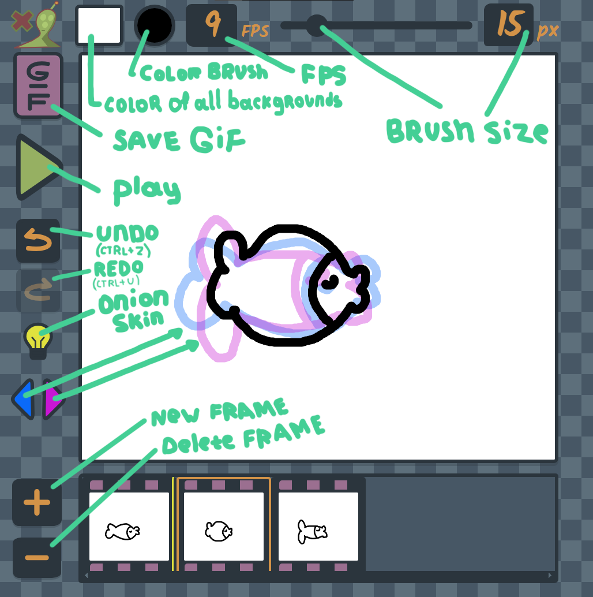

A simple HTML application for creating gif (frame by frame? draw animations).

## You can try the application online here:
[Open Alien-x animator Lite](https://romahypax.github.io/Alien-x-Frame-by-frame-drawing-saving-as-GIF-/)

## Preview

F
